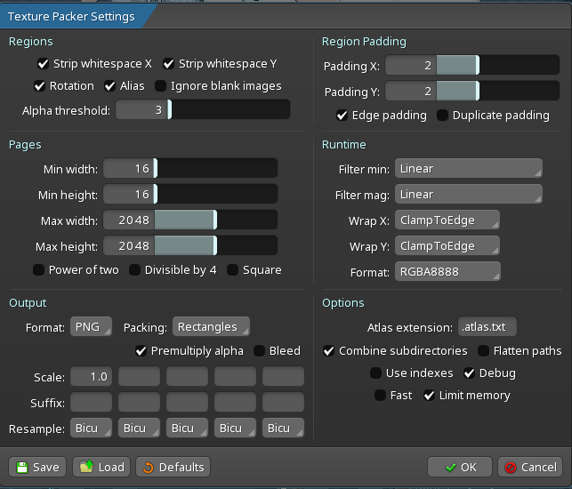
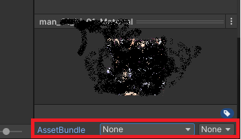

# Mad Island "animations" docs

> [!WARNING]
> This repository talks about Mad Island game, an adult game.
> Some content may not be suitable for all ages.


This page tries to cover what we know about making animations for Mad Island.

This is the combined knowledge of several modders

---

## Intro

Mad Island uses 2D sprites animated with Spine Unity v3.8 (3.8.99)

They are contained in the game assets as:

1. [name].json -- Spine skeleton data
2. [name].atlas -- The sprite atlas with all spritesheets and sprite regions that are using by this skeleton
3. [image_name].png -- Spritesheets with parts of the characters that are combined to form an animated character.
   1. Those are associated to Spine **slots**.
   2. Their name comes from the `.atlas` file


## About Spine and Unity

Spine is a 2D animation engine used in games like Mad Island.

- [Official site](https://esotericsoftware.com/)

It is a paid software, with a quite pricey license.

When using Spine with Unity, the minor version **matters**. Their runtime checks
for the version of the Spine skeleton against the runtime version, and will refuse
to import if they do not match.

In other words, for Mad Island, Spine files must be made for version 3.8.


### Note on version 3.8.75

If for some reason you are using Spine 3.8.75, spine runtime will reject the file.

There is a workaround that enables using them:

After you save your work in Spine, open the skeleton .json file and change its version to 3.8.99:

```JSON
"skeleton": {
	"hash": "...",
	"spine": "3.8.99", // <--- change here
// ....
```

Save the file and it should work.


### Alternative software

There isn't much info about alternative softwares. Some things to keep in mind:

- If any other software is used, it must be compatible with Spine OR there will be a lot of
  work to introduce a new animation library into the game -- We are not looking into that direction.
- Darkest Dungeons community seems to use DragonBonesPro (free) to work with Spine skeletons,
  but in few tests, it proved to not work very well for Mad Island. But it is open for research.
  Some topics:
    - [Darkest Dungeons guide](https://steamcommunity.com/sharedfiles/filedetails/?id=2200465472)
    - [DragonBonesPro Tools](https://github.com/DragonBones/Tools) - some tooling for dragon bones, I remember it had some stuff to convert between formats, but was kinda broken to me.
    - Remember: We are not looking to put an additional animation library into the game, just see if we can use it to make spine animations


## Extracting the assets

The game assets can be extracted with [AssetRipper](https://github.com/AssetRipper/AssetRipper).

An important note for dealing with animations is that the extracted images doesn't have the same size
as the atlas expects them to be.

For example, the atlas for `gen_02_rapes_01` contains the following:

```
gen_02_rapes_01.png
size: 8142,4062
format: RGBA8888
// ...

gen_02_rapes_012.png
size: 16,16
format: RGBA8888
// ...
```

But when you look at the png files, we have the following dimensions:

- `gen_02_rapes_01.png`: 4096x2048 (as opposed to the expected 8142x4062)
- `gen_02_rapes_012.png`: 16x16 (matching)

It is unknown whether the Atlas is corrupted, the image or something else is happening.

> [!NOTE]
> Unity does recommend the use of power of 2's when sizing textures, so this may be related.
>

For now, the "solution" for this issue is to open the image in GIMP, Paint.NET or any other image editor
that supports transparent PNG (MS PAINT DOES NOT!!) and resize it to match the atlas size.

For the example above, in Paint.NET you would:

1. Open the image `gen_02_rapes_01.png`
2. Go to Image > Resize
3. Uncheck `Maintain aspect ratio`
4. Under `Pixel size`, update `width` to 8142 and `height` to 4062 (for the example above)
5. Click `Ok`
6. Save it


## Loading assets into Spine

### (Recommended) Option 1: Direct import

If you have an Working Atlas and Skeleton, you can simply import them into Spine.

First, put all the relevant files in a folder:

1. Skeleton file (`.json`)
2. Atlas file (`.atlas` or `.atlas.txt`)
3. Images (`.png`)


#### Preparing the files (when importing from AssetRipper)

If you only have the texture atlas, spritesheet and skeleton file (e.g. extracted from the game with AssetRipper),
you must first prepare the files for Spine.

To **unpack the texture**, you should:

1. Open the skeleton file (`.json` file) in a text editor
2. Check the `skeleton.images` field:
```JSON
  {
    "skeleton": {
      // ...
      "height": 5019.65,
      "images": "./png_rapes/", //<---- This
      // ...
    },
    // ...
  }
```
3. Open Spine Editor
4. Click `Spine logo > Texture unpacker`
5. On `Atlas File`, select the `.atlas` or `.atlas.txt` file
6. On `Output Folder`, create a subfolder in the directory you are, with the same name you got from the `.json`
  (for this example, it would be `png_rapes`) and select it
7. Click `Unpack`

Once it is complete, you can check the folder and see the individual images.


#### Loading the skeleton

1. Open Spine Editor
2. Click `Spine logo > Import data`
3. Select the `.json` file
4. Click `Import`

You will get the skeleton along with its textures loaded.


If you face any error, some options would be:
   - detaching the pictures usually works fine—as long as the skeleton (the most important part) functions correctly.
   - If the skeleton doesn’t work, you have to start from scratch.


## Modifying in Spine

[Spine guide](https://esotericsoftware.com/spine-user-guide) is quite complete in explaining how to
use Spine in general.

When editing game animations to expand the same object, it is best to keep the skeleton intact and only add
additional slots/attachments or, even better, a skin.

If you can, prefer saving it as a completely new skeleton for your mod. (E.g. HFramework will support that
for new H-Scenes)


## Importing Spine skeletons into Mad Island (via Unity)

Once you have an update skeleton animatoin/texture in Spine, it is time to
get it back to Unity and then into Mad Island.

To do that we need to:

1. Export the Spine skeleton
2. Load it into Unity so we generate the other assets for the runtime
3. Make it into an asset bundle
4. Load it into Mad Island


### Export the Spine skeleton

1. Click `Spine logo > Export`
2. Select an output folder (it may be a new folder near your skeleton, or somewhere else)
3. Select those settings (if they are not by default)
   1. Format: JSON
   2. Prettyprint : checked
   3. Nonessential data: checked
   4. Animation clean up: UNchecked
   5. Warnings: checked
   6. Pack: checked
   7. If you have extracted images, select `Image folder`, otherwise, `Attachments`
4. Click on pack settings and adjust it. This part is somewhat tricky and requires some trial/error with Unity,
  see packing below for details
5. Click `Export`

@TODO: We need more details about Attachments option.

#### Packing

Animations usually require different configs for their packing so they properly work,
we usually start with a basic config and then adjust it until it works (lacking a better approach).

Basic configuration:



Changes from the default are:

1. Atlas extension: `.atlas.txt`
2. Combine subdirectories: checked
3. Debug: checked

Note that Max width/Max height may cause your sprite to break into more files,
Mad Island seems to commonly increase the size so it comes out into only 1 or 2 images,
you may do it now (you can even use the size of the atlas you used at the beggining)

If this settings doesn't render properly in Unity (in the upcoming steps), you should go
back here and try to adjust it further.

Sometimes, enabling `Flatten paths` makes it work, but it is not always the case.


### Loading the skeleton into Unity

> [!NOTE]
> IF you are using Spine v3.8.75, remember to patch the version before following these steps.
> 

1. Create a new project in Unity v2021.3.6f1
2. Install Spine runtime 3.8 on it.
   1. You can download at [Spine site](https://pt.esotericsoftware.com/spine-unity-download)
   2. On Unity, click Assest > Import Package > Custom Package and select it
3. Drag and drop the files into Unity assets folder, you should add:
   1. the skeleton .json
   2. the .atlas.txt file
   3. the .png files that resulted from the packing process
4. Once they are loaded, Spine Runtime will process it and generate a few other files
5. Drag and drop the generated SkeletonData into the Unity scene as `SkeletonAnimation` and check if it renders properly

If it doesn't render properly or you have any error during the process, try packing it differently
when exporting from Spine.


### Loading the skeleton into Mad Island

Once you get it working in Unity, you are now ready to make it available to your mod in Mad Island.

> [!NOTE]
> This covers how to get it available to the game, but you will likely need your own
> code to get these showing in the game. This is not covered here for now.
> 

In order to get it into the game, you should pack your skeleton files into an AssetBundle.
There are several ways to do it, but the most basic one is to add the following Editor script
to your Unity.

1. Create a folder in the root of your Unity assets called `Editor`
2. Create a C# script called `CreateAssetBundles` and paste the following code into it

```csharp
using UnityEditor;
using System.IO;

public class CreateAssetBundles {
    [MenuItem("Assets/Build AssetBundles")]
    static void BuildAllAssetBundles() {
        string assetBundleDirectory = "Assets/AssetBundles";
        if(!Directory.Exists(assetBundleDirectory)) {
            Directory.CreateDirectory(assetBundleDirectory);
        }
        BuildPipeline.BuildAssetBundles(assetBundleDirectory, BuildAssetBundleOptions.None, BuildTarget.StandaloneWindows);
    }
}
```

3. Put all files related to the skeleton (Both the imported ones and generated ones) into an AssetBundle,
  by selecting each file and adding the bundle in the side editor
  
    

4. Once you are done, go to `Assets > Build AssetBundles`
5. Your AssetBundle will be available at Assets/AssetBundles folder.

You can now use BepInEx or some mod that allows you to load it into the game.


## Other notes about modifying animations

### Changing Existing Slots:
Changing an existing slot works well.

### Adding New Slots
Adding a new slot is possible, but note that the order will always be overwritten.

If you’re simply aligning two images without overlapping, it works fine.
However, if you try to change the order or rewrite the order in the page renderer, it will crash.

**Best Approach:**

The best method for adding or appending animations is to replace the target skeleton with your custom one.
If you leave the animation strings intact and all settings at their defaults, then edit and add your custom animations, you should be able to achieve your goals.

### Using Animations from Other Games
You can easily use any animation from any game.

For example, importing from Night of Revenge into Mad Island (nm088 did it).

Once you understand the process, it’s really straightforward.

It’s not possible to swap an atlas in-game, but exchanging skeletons tends to work better overall. 


## Other initiatives

While this docs is focusing on getting assets from Spine into prefabs and loading them into the
game, more like the devs would, we have some initiatives doing things in other directions:

1. Astemir is working in a library to inject animations, items, crafts and furnitures (not released yet) -- [MadCore](https://github.com/AstemirDev/MadCore)
2. nm088 is working in a framework to allow new skins, weapons, walls, clothing and more with no code changes -- [temporary docs](./nm088-framework.md)
3. Yotan's [HFramework](https://github.com/yotan-dev/mad-island-mods/tree/main/HFramework) contains ways to load animations into the game sex process.
